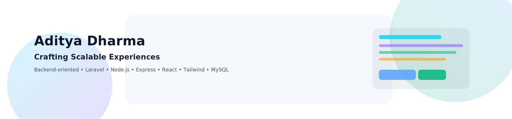
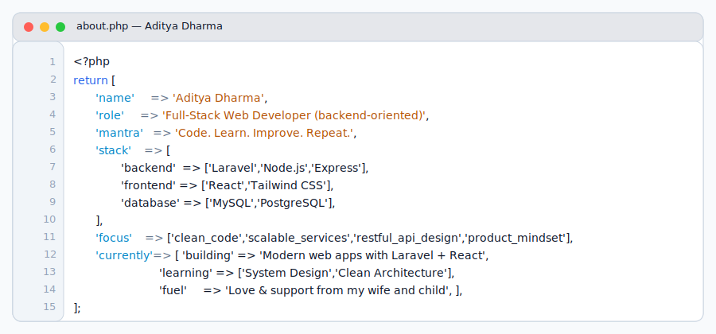

<!-- Banner: auto light/dark -->

  <picture>
    <source media="(prefers-color-scheme: dark)" srcset="assets/banner-dark.svg" />
    <source media="(prefers-color-scheme: light)" srcset="assets/banner-light.svg" />
    
  </picture>

---

<h1 align="center">🚀 Aditya Dharma</h1>

  <strong>Full-Stack Web Developer</strong>  
  <em>Building scalable backend systems and modern web apps with Laravel, Node.js, and React.</em>

  

  
  

---
## 🧭 About Me

  <picture>
    <source media="(prefers-color-scheme: dark)" srcset="assets/aboutme-vscode-dark.svg" />
    <source media="(prefers-color-scheme: light)" srcset="assets/aboutme-vscode-light.svg" />
    
  </picture>

---
## 🧰 Tech Stack

  
</>

  
---

## 🧠 What I Do — Feature as a Service

### 🧱 `/services/backend`
- Build and maintain **scalable backend services** using Laravel, Node.js & Express  
- Architect systems that handle growth, reliability, and clean domain logic  
- Implement secure **authentication**, robust validation, and efficient query handling

### 🔗 `/services/api`
- Design **RESTful APIs** that are clear, consistent, and future-proof  
- Integrate third-party services and internal microservices seamlessly  
- Ensure maintainability with versioning, documentation, and testing

### 🎨 `/services/frontend`
- Craft **responsive, component-based UIs** with React + Tailwind CSS  
- Prioritize performance, accessibility, and user experience  
- Implement state management and API consumption with clean patterns

### ⚙️ `/services/automation`
- Automate workflows with **Docker**, queues, and background jobs  
- Improve DX (Developer Experience) with scripts, tools, and CI-ready environments

### ❤️ `/services/motivation`
- Driven by love and support from my wife and child — my core reason to grow and build

---

## 📌 Featured Projects (auto-updated)

<!-- FEATURED:START -->

<!-- FEATURED:END -->

---

### 📊 GitHub Stats

  
  

### 🔥 Contribution Streak

  

### 📈 Activity Graph

  

---

### 🔗 Let’s Connect

  
  

---

<i>⭐ Building meaningful solutions — one commit at a time.</i>

<!-- Optional: Snake animation -->

  

